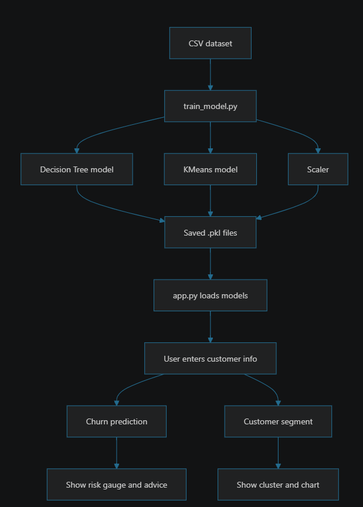
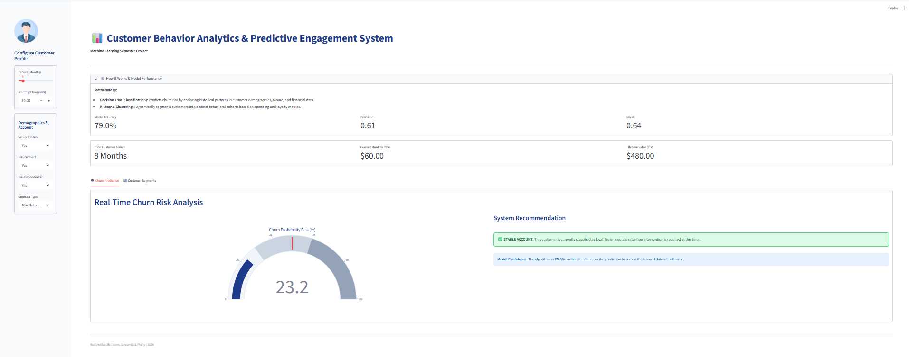
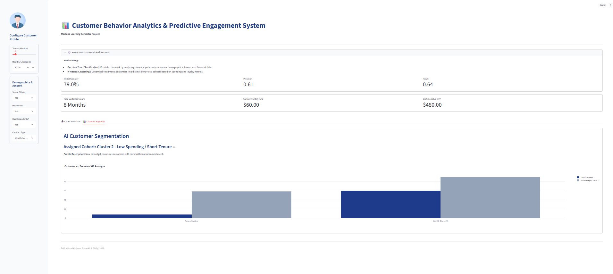

# 📊 Customer Behavior Analytics


A complete machine learning project for analyzing telecom customer behavior, with:
- **Customer Churn Prediction** (supervised learning)
- **Customer Segmentation** (unsupervised learning)

This project helps businesses identify customers likely to churn and discover meaningful customer groups for targeted marketing and retention strategies.

---

## 🚀 Project Highlights

- ✅ End-to-end ML workflow
- ✅ Data preprocessing and feature engineering
- ✅ Churn prediction using a **Decision Tree Classifier**
- ✅ Customer segmentation using **KMeans Clustering**
- ✅ Saved and reusable trained models (`.pkl`)
- ✅ Visual outputs and architecture flowchart
- ✅ Interactive app interface (`app.py`)

---

## 🧠 Business Use Cases

- Predict customers who may leave the service
- Segment customers into behavior-based groups
- Enable personalized offers and proactive retention campaigns
- Support data-driven decision making in customer success teams

---

## 🗂️ Repository Structure

```bash
customer-behavior-analytics/
│
├── app.py                                  # Main application
├── requirements.txt                        # Python dependencies
│
├── data/
│   └── WA_Fn-UseC_-Telco-Customer-Churn.csv
│
├── src/
│   └── train_model.py                      # Model training pipeline
│
├── models/
│   ├── decision_tree_model.pkl             # Churn prediction model
│   ├── kmeans_model.pkl                    # Segmentation model
│   ├── label_encoder.pkl                   # Encoder for categorical labels
│   └── scaler.pkl                          # Feature scaler
│
└── images/
    ├── 01_flowchart.png
    ├── 01_churn_prediction.png
    └── 01_customer_segmentation.png
```

---

## ⚙️ Installation & Setup

### 1) Clone the repository
```bash
git clone https://github.com/AbdulRehman393/customer-behavior-analytics.git
cd customer-behavior-analytics
```

### 2) Create virtual environment (recommended)
```bash
python -m venv venv
```

- **Windows**
  ```bash
  venv\Scripts\activate
  ```

- **macOS/Linux**
  ```bash
  source venv/bin/activate
  ```

### 3) Install dependencies
```bash
pip install -r requirements.txt
```

---

## ▶️ Usage

### Run model training script
```bash
python src/train_model.py
```

### Run application
```bash
python app.py
```

> Make sure model files are present in the `models/` directory before running the app.

---

## 🧪 Models Used

### 1) Churn Prediction
- **Algorithm:** Decision Tree Classifier
- **Output:** Predicts whether a customer is likely to churn

### 2) Customer Segmentation
- **Algorithm:** KMeans Clustering
- **Output:** Groups customers into distinct segments based on behavior patterns

---

## 🖼️ Project Visuals

### 🔁 Workflow / Architecture


### 📉 Churn Prediction Visualization


### 👥 Customer Segmentation Visualization


---

## 📦 Dependencies

Key libraries used (from `requirements.txt` and project usage):
- `pandas`
- `numpy`
- `scikit-learn`
- `matplotlib` / `seaborn` (if used in visuals)
- `streamlit` or app-related library (if applicable in `app.py`)

> Exact versions are defined in [`requirements.txt`](requirements.txt).

---

## 🔮 Future Improvements

- Add model evaluation dashboard (accuracy, precision, recall, F1, ROC-AUC)
- Hyperparameter tuning for better prediction quality
- Deploy as a web app (Streamlit / Flask / FastAPI)
- Add CI pipeline for automated testing and linting
- Add Docker support for portable deployment

---

## 🤝 Contributing

Contributions are welcome!  
If you'd like to improve this project:

1. Fork the repository
2. Create a feature branch
3. Commit your changes
4. Open a Pull Request

---

## 👤 Author

**Abdul Rehman**  
GitHub: [@AbdulRehman393](https://github.com/AbdulRehman393)

---

## ⭐ Support

If you found this project useful, please give it a **star** ⭐ on GitHub — it helps and motivates further development.
